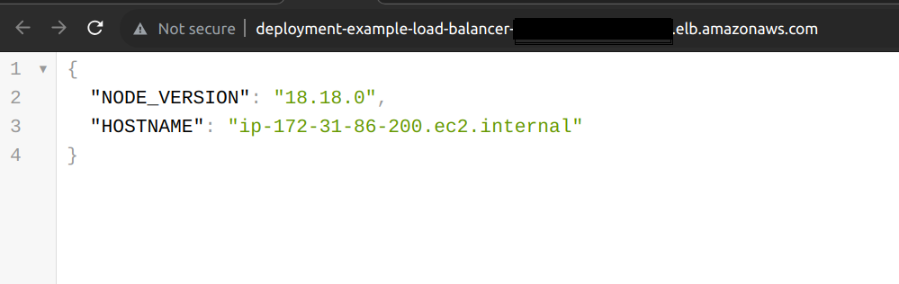

# CI/CD Pipeline on AWS environment with dockerized express js/ts app and a SQS queue worker

## Tools

* Docker / ExpressJs / AWS SDK for JavaScript
* AWS S3
* AWS SQS
* AWS CloudWatch Logs
* AWS CodePipeline
* AWS CodeCommit 
* AWS Elastic Container Registry (ECR)
* AWS EventBridge / EventBridge Rules / EventBus
* AWS Elastic Container Service (ECS)
  + Clutser 
  + Service
  + Task
  + Service Connect
  + AWS Cloud Map (or Namespaces)
* AWS Elastic Load Balancer (ELB)
  
## Project 

To deploy nodejs express application using Docker engine and multiple AWS serivices.

## Files 

+ [cloudformation/pg-database-template-06.yaml](./cloudformation/pg-database-template-06.yaml "cloudformation/pg-database-template-06.yaml") contains the cloudformation template for RDS Postgres DB that exports the credencials to SSM Parameters as well
+ [cloudformation/pipeline.template-02.yaml](./cloudformation/pipeline.template-02.yaml "cloudformation/pipeline.template-02.yaml") contains the cloudformation template for AWS CI/CD pipeline
+ [ts-express-app/server.js](./ts-express-app/server.ts "ts-express-app/server.ts") is the express app entry point
+ [Dockerfile](./Dockerfile "Dockerfile") contains all the commands to assemble an image
+ [buildspec.yml](./buildspec.yml "buildspec.yml") is collection of build commands and related settings, in YAML format, that CodeBuild uses to run a build
 

## Workflow

+ Source code is stored in Github
+ When source code is updated with new push event, the pipeline is triggered. Below are the list of different stages of pipeline.
  + Build: 
    + AWS uses buildspec.yml file to build the image with the Dockerfile
  + Push:
    + Docker image is pushed to ECR Registry
  + Deploy:
    + Docker image is used to run a container in the ECS Service
+ Nodejs application is reachable with {LoadBalancerUrl} url that is shown in the Output tab of Cloudformation
  
  
 
 ### AWS CodePipeline Stpes 
 
 
 

 ### Github WebHook (To trigger aws codepipeline)
 
 

 ### ECS Tasks 
 
 
 

 ### Express.js App
 
 

